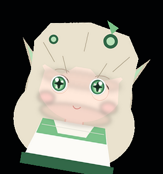

# 目光跟随鼠标的桌宠（可换纳西妲立绘）

这是本目录里的自制桌宠：一个无边框透明小窗口，**眼睛（瞳孔层）会实时盯着鼠标光标**，
还会头部微倾、随机眨眼、左右张望、蹦一下、被拖拽、被抛出去会掉下来并弹跳，
左键点一下冒爱心，右键有菜单。

- 程序：`pet.py`（Python 3.9+ / tkinter + Pillow）
- 配置：`pet.json`（所有参数都在这里）
- 素材：`assets/namecard_placeholder/`（**占位素材，不是纳西妲官方美术**，换成你自己的图即可）
- 启动：双击 `start_pet.bat`，出问题就双击 `start_pet_debug.bat`

> **这台机器的已知坑（都已在代码里规避）**：
> 1. `python` / `py` 指向的是 **Python 3.10，没装 Pillow**，而且 pypi 的 SSL 被拦、
>    装不上包。所以 `launcher.ps1` 会自动挑一个自带 Pillow 的 Python（本机是自带的 3.12）。
> 2. Windows PowerShell 5.1 / cmd 按 ANSI(GBK) 解析 `.ps1` 和 `.bat`，**注释里的中文也会
>    把后一行弄坏**（行尾的续行符 ` 被吃掉过一次）。所以启动脚本全部改成纯 ASCII。
> 3. 同一批脚本还踩了另一个坑：**LF-only 换行**。PowerShell 5.1 对 LF 换行的脚本会解析错乱
>    ——多行注释 `#>` 和 here-string 的终止符识别不出来，直接把后面整段代码吞掉，报出假的
>    "缺少 }"。所以 `.ps1` / `.bat` 一律 **CRLF**。
> 4. **不要调用 `SetProcessDpiAwareness` / `SetProcessDPIAware`**：会让 Tk 的坐标系劈叉
>    （窗口按逻辑像素、画布按物理像素），桌宠被裁掉大半还跑到屏幕外。缩放用 `pet.json` 的 `scale`。
> 5. **无边框窗口必须显式声明尺寸**：`overrideredirect(True)` 之后窗口不会跟着画布的请求尺寸走，
>    会停在 Tk 默认的 200x200；同时 `pack()` 要等事件循环才布局，那之前 canvas 一直是 1x1。
>    现在的写法是：先算好坐标 → `root.geometry("WxH+x+y")` → `canvas.place(...)` → `update()`。
> 6. 关终端会带走桌宠：进程共用控制台时会收到 `CTRL_CLOSE_EVENT`。现在用 `pythonw.exe` +
>    `DETACHED_PROCESS` + `CREATE_BREAKAWAY_FROM_JOB` 启动，桌宠没有控制台。
> 7. 调试期发现：这台机器上 `PIL.ImageGrab` **抓不到分层透明窗口**（连对照用的纯色探针窗口也抓不到，
>    截出来是过期的桌面内容）。所以别用截图判断"有没有显示出来"，用窗口内自检 `verify_pet.py`。



---

## 一、现成能直接用的（网上搜到的）

### 1. 最省事：Shimeji（二次元桌宠老牌方案，有现成纳西妲）
- 网页版：**Nahida shimeji** — <https://shimejis.xyz/directory/shimeji/nahida-0004a7>
  装个 Chrome 扩展（<https://shimejis.xyz/download>）就能在桌面上养，会走会爬会跳。
  注意：这类网页版是"在浏览器窗口上跑"，不是真正的桌面层。
- 桌面版（Windows 原生、可加载自定义 img/xml）：
  - **VShimeji**（Shimeji-ee 的活跃分支）— <https://github.com/Valkryst/VShimeji>
  - 老牌 **Shimeji-ee / 迷你桌宠**（国内下载站）— <https://soft.3dmgame.com/down/217194.html>
  - 汉化与素材说明参考：<https://github.com/YuZhu412/zhizhiji-shimeji>
- B 站上有人做过纳西妲桌宠演示，可以顺藤摸瓜找作者分享的整合包：
  <https://www.bilibili.com/video/BV17G411j7ba/>

### 2. 想要"喂养 + 互动 + 换模组"的框架：DyberPet（呆啵宠物）
- 项目：<https://github.com/ChaozhongLiu/DyberPet>（PySide6，国内社区活跃）
- 素材合集（别人做好的角色包，找找有没有纳西妲）：
  <https://gitcode.com/GitHub_Trending/dy/DyberPet/blob/master/docs/collection.md>
- 优点：自带养成、焦点计时、模组系统；缺点：**默认不带目光跟随**，要自己写。

### 3. 最像"目光跟随"的：Live2D 系
Live2D 模型天生带**视线追踪（LookAt）**参数，鼠标到哪眼睛就跟到哪，还带呼吸、头发飘动。
- **Live2DViewerEX**（Windows 桌宠模式，导入模型即用，支持鼠标跟随）：
  <https://www.diyiyou.com/pcsoft/10910.html>
- 免费的 **Live2D Cubism Viewer / VTubeStudio** 也能开"跟随鼠标"做桌面挂件
- 视线追踪到底怎么实现的，官方教程（做自己的模型时必看）：
  <https://docs.live2d.com/cubism-sdk-tutorials/lookat/>
- 纳西妲的 Live2D 模型（`.model3.json`）网上有爱好者分享，B 站搜索"纳西妲 live2d 桌宠"能找到分享贴。

### 4. 壁纸引擎路线（不算桌宠，但最便宜）
Wallpaper Engine 里搜"纳西妲 / 小草神"，有人做了**带鼠标交互/视线跟随**的动态壁纸：
<https://www.bilibili.com/video/BV1KN4y1871F/>

### 5. 自己改的现成开源桌宠（Python，代码短好改）
- **DyberPet**（见上）
- **OceanPet**（macOS 原生，鼠标视线追踪 + 散步）：<https://github.com/cpp285/OceanPet>
- **BongoCat** 的自定义模型导入：<https://blog.gitcode.com/ad02240c681c40d244cbd28a7ca92b5e.html>
- 通用桌宠小项目：<https://github.com/leiyong711/DesktopPet-1>

---

## 二、想自己做一个"眼睛跟着鼠标转"的：原理只有 3 行

不用 Live2D 也能做，核心就一件事：

```
眼睛方向 = 归一化(鼠标位置 - 眼睛锚点)
瞳孔偏移 = 眼睛方向 × 最大偏移量
```

每帧把**瞳孔图层**按这个偏移贴到**身体图层**上面，看起来就是"盯着你看"。
再叠一点惯性和限位（瞳孔不会跑出眼眶），就非常自然了。本目录的 `pet.py` 就是这么干的：

```python
ax = 宠物窗口左上角x + 宽 * anchor_x        # 视线起点（额头附近）
ay = 宠物窗口左上角y + 高 * anchor_y
vx, vy = 鼠标x - ax, 鼠标y - ay
d = hypot(vx, vy)
mag = min(1.0, d / 420.0) * max_pupil_offset
offset = (vx / d * mag, vy / d * mag * 0.75)  # 竖直方向收敛一点更自然
eye_pos += (offset - eye_pos) * min(1, dt * 12)  # 惯性平滑
```

配套小技巧（都已经实现在 `pet.py` 里）：
- **眨眼**：把眼睛图层纵向压扁到 8%，用 `sin` 曲线做 0.16 秒的过渡
- **头部微倾**：瞳孔越靠边，整个身体旋转 ±6°（`Image.rotate`）
- **随机张望**：每 1.6~4.5 秒随机挑一个行为（发呆 / 看向别处 / 蹦一下）
- **透明背景**：Windows 上 `root.attributes("-transparentcolor", "#010203")`，
  渲染时把 alpha < 90 的像素涂成这个色键就能抠干净
- **别用 `-alpha`**：它会把整窗变半透明，连角色一起变淡

---

## 三、把占位素材换成真正的纳西妲（半自动，两步）

这套流程已经工具化了。**你只需要下载一张图 + 在图上点两下眼睛**，其余（抠背景、拆瞳孔层、
补眼窝、算坐标、改配置、跑自检）全部由脚本完成。

### 步骤 1：下载一张立绘

要求：**正面、能看到完整头部、背景比较干净**。

| 来源 | 说明 |
| --- | --- |
| [RockChinQ/NahidaImages](https://github.com/RockChinQ/NahidaImages) | GitHub 上的纳西妲图库，素材最集中 |
| [原神 WIKI 抽卡立绘](https://wiki.biligame.com/ys/%E6%96%87%E4%BB%B6:%E7%BA%B3%E8%A5%BF%E5%A6%B2%E6%8A%BD%E5%8D%A1%E7%AB%8B%E7%BB%98.png) | 官方抽卡立绘，高清 |
| [Fandom: Nahida/Gallery](https://genshin-impact.fandom.com/wiki/Nahida/Gallery) | 官方宣传图，多为透明 PNG |
| [The Spriters Resource](https://models.spriters-resource.com/pc_computer/genshinimpact/asset/359873/) | **游戏内切片素材**（含各表情的脸部件），本身就是透明 PNG，最好用 |
| [B 站：全角色立绘透明图](https://m.bilibili.com/opus/980011537236230162) | 网友整理的透明立绘合集 |

把图存成 `desktop-pet/images/nahida.png`（`images/` 目录已建好）。

> 这些是米哈游的官方美术资源。**个人自用做桌面装饰没问题，但别二次分发、别商用**。
> 本仓库不附带任何官方图片，只提供处理工具。

### 步骤 2：跑拆层工具，点两下眼睛

```powershell
python prepare_sprite.py images/nahida.png
```

界面里做的事（右侧有文字提示）：

1. 勾选"载入时自动抠背景"（四角颜色漫水，纯色/浅色底最好用；
   复杂背景请先用 [remove.bg](https://www.remove.bg/zh) 处理再进来）
2. 拖黄框四角 / 滚轮缩放，**把角色的头脸放进黄框**（黄框就是最终输出的 320×340，比例已锁）
3. **在左眼、右眼中心各点一下**（先左后右；点错了按 `E` 清空重来）
4. 拖白色小方块调眼睛框大小（默认按瞳距自动估算，一般不用动）
5. 按 `S` 保存

保存后脚本会自动：

- 裁剪缩放到 320×340 → `assets/custom/body.png`
- 抠出瞳孔层 → `assets/custom/eye_l.png` / `eye_r.png`
- 把身体上的眼睛用**周围肤色 + 眼窝径向渐变**补掉（所以瞳孔移动时不会露底）
- 算好 `eye_layout` 并写回 `pet.json`（含 `sprite_dir` / `eyes` / `eye_layout`）
- 生成合成预览 `preview.png`，并**自动跑一次渲染自检**告诉你结果

然后直接启动桌宠即可：

```powershell
start_pet.bat
```

想回退到占位素材，把 `pet.json` 的 `sprite_dir` 改回 `assets/namecard_placeholder`。

### 如果效果不理想，通常是这几个原因

| 现象 | 原因 / 处理 |
| --- | --- |
| 眼睛跟着鼠标动时露出"空洞" | `eye_size` 给大了，超过真实眼眶。调小眼睛框，或在工具里把白色方块往里拖 |
| 瞳孔移动时画面边缘有个硬边圆圈 | 眼睛框比眼眶大。同上，缩小眼睛框、让椭圆刚好贴住眼眶 |
| 抠背景把头发/浅色衣服也抠掉了 | 背景和角色颜色太接近。别用漫水，改用 remove.bg 抠好透明 PNG 再进来 |
| 眼神幅度太大、眼睛像"飞出去" | 把 `pet.json` 里的 `max_pupil_offset` 调小（真实立绘建议 3~4） |
| 桌宠太大/太小 | 改 `pet.json` 的 `scale` |

### 备选：完全不用工具的土办法

1. 抠一张透明 PNG 立绘 → 存成 `assets/xxx/body.png`
2. 用图片编辑器把**瞳孔区域**裁出来单独存成两张 `eye_l.png` / `eye_r.png`，
   再把 `body.png` 上原来的瞳孔用吸管取色涂掉
3. 手动量坐标填 `pet.json` 的 `eye_layout`（用画图打开 `body.png`，看左下角状态栏坐标）

工具做的事就是把这个流程自动化，手做完之后可以用 `python verify_pet.py` 验证。

## 四、操作说明

| 操作 | 效果 |
| --- | --- |
| 鼠标移动 | 眼睛跟着看（可右键菜单关闭） |
| 左键拖拽 | 搬家；松手会掉落并弹跳 |
| 左键单击 / 双击 | 冒爱心 |
| 右键 | 菜单：打招呼 / 目光跟随 / 总在最前 / 缩放 / 退出 |

## 五、文件说明

| 文件 | 作用 |
| --- | --- |
| `pet.py` | 主程序（渲染 + 行为 + 交互） |
| `launcher.ps1` | **真正的启动器**：挑解释器、记录日志、报告错误（纯 ASCII + CRLF） |
| `detach_launch.ps1` | 用 `CreateProcess` + `DETACHED_PROCESS`/`CREATE_BREAKAWAY_FROM_JOB` 把桌宠脱离控制台与本进程树启动 |
| `start_pet.bat` | Windows 双击启动（调用 launcher.ps1） |
| `start_pet_debug.bat` | 同上，但保留窗口显示日志（`--debug`） |
| `run_pet.py` | 纯 Python 启动器（没有 PowerShell 时的退路，不具备脱离能力） |
| `verify_pet.py` | 自检渲染：逻辑/物理尺寸是否一致、内容像素是否画全 |
| `verify_detach.ps1` | 自检脱离：桌宠进程的控制台进程数应为 0 |
| `find_parse_error.ps1` | 用 PowerShell 5.1 解析启动脚本，报告语法错误行号 |
| `pet.json` | 全部可调参数 |
| `prepare_sprite.py` | **立绘拆层工具**：GUI 里点两下眼睛，自动抠背景/拆瞳孔层/补眼窝/写回 pet.json |
| `test_prepare_sprite.py` | 拆层流水线自检（用合成假图跑，不需要真实立绘和 GUI） |
| `make_placeholder_pet.py` | 重新生成占位素材（`python make_placeholder_pet.py [目录]`） |
| `make_preview.py` | 生成静态预览图 `preview.png` |
| `verify_pet.py` | **自检**：窗口内部检查逻辑尺寸/物理尺寸是否一致、内容像素是否画全，并导出 `verify_window.png` |
| `assets/namecard_placeholder/` | 占位素材（可整个换成自己的目录） |
| `pet.log` | 每次启动的记录（解释器、参数、错误） |
| `pet_crash.log` | 崩溃时的完整 traceback（只有崩了才会有） |
| `selftest_frame.png` | 自检渲染出来的一帧 |
| `preview.png` | 身体+眼睛合在一起的静态预览图 |

## 六、出问题了怎么查

| 现象 | 原因 / 处理 |
| --- | --- |
| **关掉终端，桌宠也跟着关了** | 已修。原来桌宠是 `python.exe` 的子进程，和终端共用一个控制台；关终端时 Windows 会给该控制台内**所有**进程发 `CTRL_CLOSE_EVENT`，桌宠被一起带走。现在由 `detach_launch.ps1` 用 `CreateProcess` + `DETACHED_PROCESS \| CREATE_NO_WINDOW \| CREATE_NEW_PROCESS_GROUP \| CREATE_BREAKAWAY_FROM_JOB`、并改用 `pythonw.exe` 启动，桌宠没有控制台、也不在本进程树里。验证：`verify_detach.ps1` 会打印"控制台进程数 = 0" |
| 双击后终端一闪就没了、什么也没发生 | 已修。原因是脚本里出现了非 ASCII 字符 **以及 LF-only 换行**：PowerShell 5.1 / cmd 按 ANSI(GBK) 解析这几类文件，LF-only 还会让 here-string 和多行注释吞掉后面整段代码，报假的"缺少 }"。现在 `.ps1`/`.bat` 全部是 **纯 ASCII + CRLF**，自检见下 |
| 启动器关了之后桌宠也没了 | 已修（同上，进程已脱离） |
| 双击没反应，桌面上也找不到 | 先看 `pet.log`；再双击 `start_pet_debug.bat`，窗口里会写明哪个解释器失败、为什么 |
| 进程在跑、窗口也有，但里面是空的 | 画布没被布局撑开（`canvas=1x1`）或窗口停在 200x200。跑 `python verify_pet.py`，它会直接告诉你；正常输出应为"正常（整幅画完）"，不透明像素约 56000 |
| 桌宠被裁掉一多半 / 跑到屏幕外 | 进程 DPI 感知被改过，逻辑/物理坐标劈叉。检查有没有人加了 `SetProcessDpiAwareness`，删掉即恢复 |
| 提示找不到 Pillow | 解释器没装 Pillow。执行 `python -m pip install --user pillow`，或设 `DSH_PET_PYTHON` 指向自带 Pillow 的 Python |
| 程序在跑但看不见窗口 | 可能落在屏幕外，或没置顶。删掉 `pet.json` 里的 `start_position`（设为 `null`）后重启，会回到默认位置 |
| 窗口里角色底下有黑/灰方块 | 你的显示器/远程桌面不支持色键透明。把 `pet.py` 顶部的 `COLOR_KEY` 换成一个素材里绝对没有的颜色 |
| 桌宠太小 / 太大 | 用右键菜单缩放，或改 `pet.json` 的 `scale` |
| 想关掉它 | 右键 → 退出；也可以 `Get-Process pythonw \| Stop-Process`（现在进程名是 `pythonw`） |
| 想让它在第二块屏幕 | 在 `pet.json` 里写死 `"start_position": [x, y]`，x/y 是屏幕坐标 |
| 用截图判断它有没有显示 | 不可靠：本机 `ImageGrab` 抓不到分层透明窗口（对照探针也抓不到）。用 `verify_pet.py` 做窗口内自检 |

### 脚本自检（改完脚本后跑一下）

```powershell
# 1) 语法：必须 0 个错误
powershell -NoProfile -Command "$e=$null; [void][System.Management.Automation.Language.Parser]::ParseFile('launcher.ps1',[ref]$null,[ref]$e); $e.Count"

# 2) 编码与换行：非 ASCII 必须为 0，CR 必须等于 LF
foreach ($f in 'launcher.ps1','detach_launch.ps1','start_pet.bat','start_pet_debug.bat') {
  $b=[IO.File]::ReadAllBytes($f)
  "{0,-22} 非ASCII={1} CR={2} LF={3}" -f $f,($b|?{$_ -gt 127}).Count,($b|?{$_ -eq 13}).Count,($b|?{$_ -eq 10}).Count
}

# 3) 脱离验证：桌宠进程的控制台进程数必须是 0
powershell -NoProfile -ExecutionPolicy Bypass -File verify_detach.ps1
```

## 七、换素材时想加的新玩法（可以再找我加）

- 多套表情（生气/开心/困）按定时器切换
- 站在任务栏上走、沿窗口边缘爬（Shimeji 那种）
- 说话气泡 + 接入大模型闲聊
- 系统托盘图标、开机自启
- 打包成单文件 `.exe`（`pyinstaller --noconsole --onefile pet.py`）
